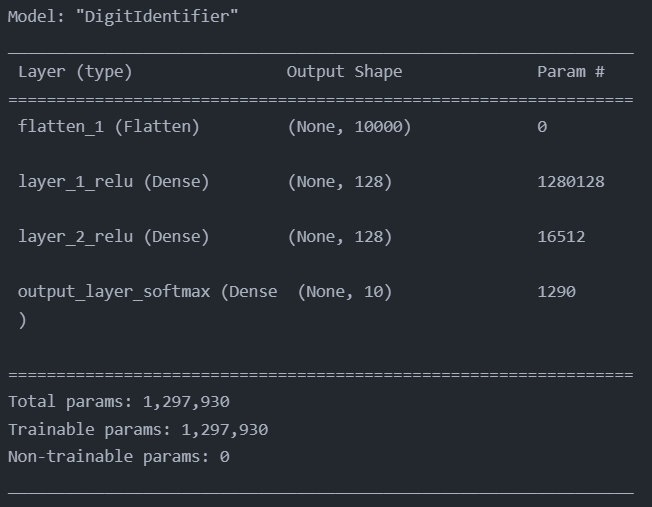
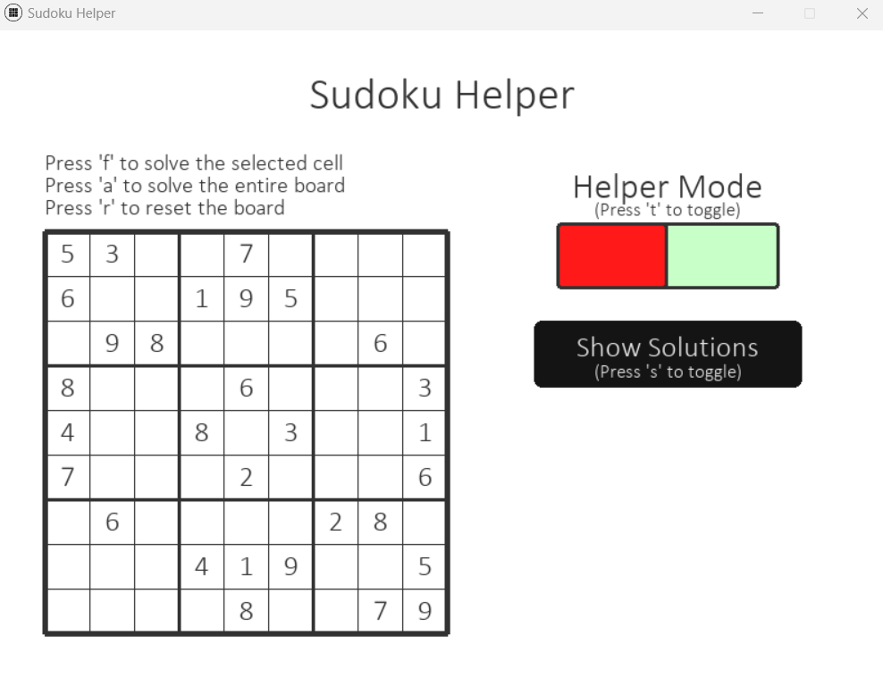
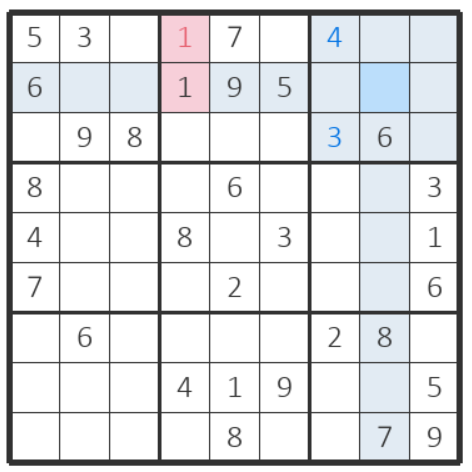
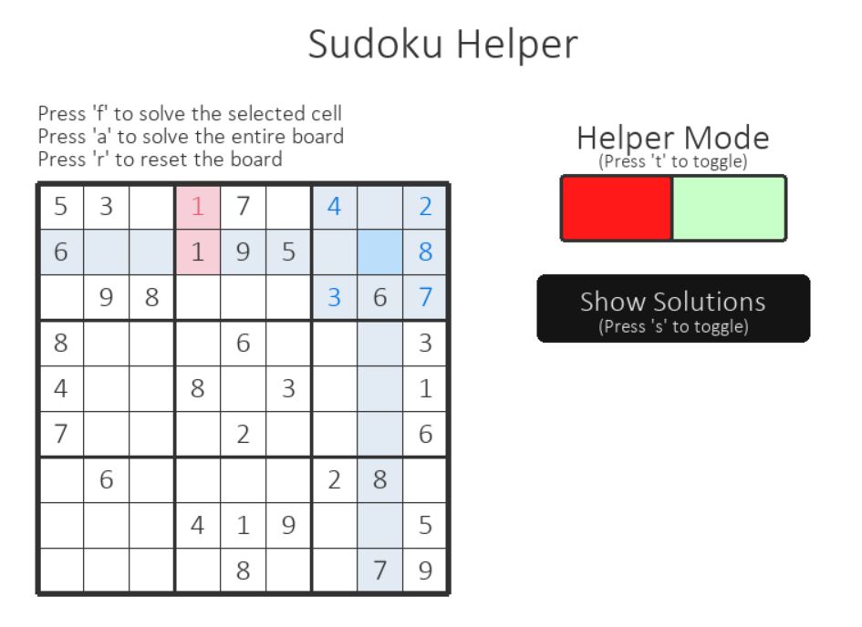
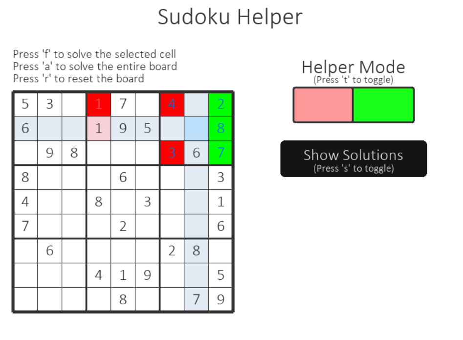
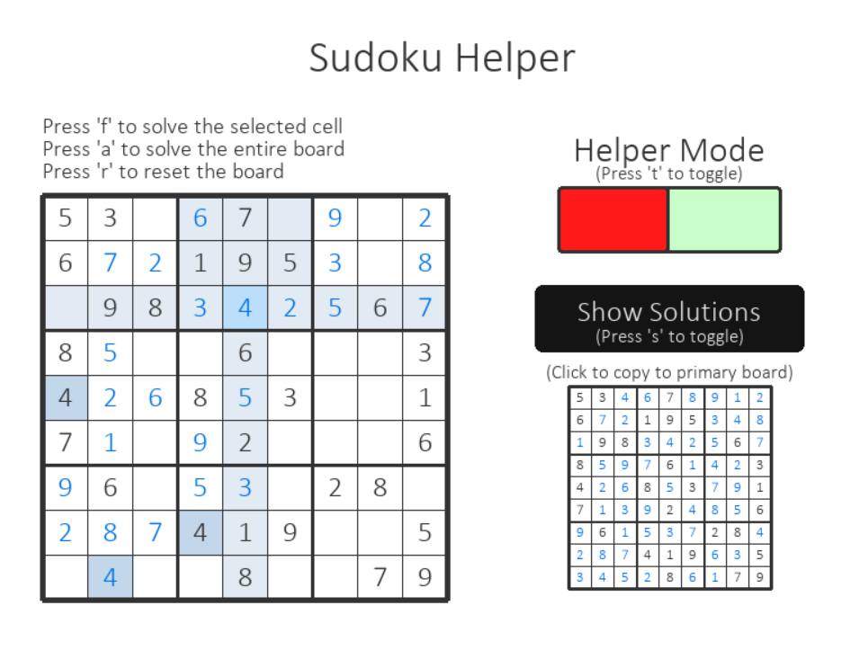

# Sudoku Helper
A program with the goal to allow users easily import a sudoku board and get hints. The application uses Python 3.9.7. I created this project primarily to learn basic computer vision with TensorFlow and OpenCV and 2-D game creation with PyGame.
## Installation
The program runs on your local system

Clone the git repository
```
git clone https://github.com/ZachHendon/Sudoku-Helper
```
Install the required python libraries specified in [requirements.txt](requirements.txt)

To run the program, copy an image of a sudoku board to your clipboard and run [Game.py](Game.py)
## Description
### Image Processing
The application will convert the image from your clipboard to a numpy array for image processing with OpenCV. It begins by converting it to an inverted binary image and ([finding the outermost square](https://en.wikipedia.org/wiki/Ramer%E2%80%93Douglas%E2%80%93Peucker_algorithm)). It evenly splits up this square into the 81 images that make up each square of the board. For each of the squares, it centers and resizes the digit to match the predition dataset.
### Digit Prediction
A TensorFlow model is then used to predict the digit contained in each on of the squares (if it contains one). The training model was built from scratch. This was done by iterating over 200 fonts and creating centered and size-normalized images 1-9. The model was trained using a basic TensorFlow model.



### Board Solver
The board is solved on program initialization. It uses a simple [backtracking method](https://en.wikipedia.org/wiki/Backtracking).

### Board Class
The [Board class](BoardCreator.py) has several functions. The first is to take an image and convert it to a 9x9 grid using nested lists ([in-depth process described above](#image-processing)). Each square is an instance of the class, Cell, having attributes value, mutable, correct, cell_color, and value_color. Board has attributes grid, [solved_grid](#board-solver), and selected_cell. It also contains the useful methods print_grid, deselect_cell, select_cell, evaluate_board, and update_square (succinct descriptions of the methods are described above the method in [BoardCreator.py](BoardCreator.py)).

### Game/UI
The UI of the program's board is independent of the board it was taken from. When the program is first initialized, there is a sudoku grid on the left the initial values entered. There are also two buttons on the right and some instructions at various locations. The board mechanics are highly featured, allowing users to navigate with their mouse, arrow keys, or tab. To enter a value, simply click the corresponding digit on the keyboard. The UI clearly displays the selected square highlights related squares that will be affected by input. It also gives immediate feedback on whether or not there are immediate errors. The board also presents some useful shortcuts: press 'f' to fill in the correct value for the currently selected square, press 'a' to fill in the correct value for the entire board, and press 'r' to reset the board to its initial state. Click the top right button or press 'esc' to close the window.




The top button is used to toggle helper mode. Helper mode will explicitely show you whether or not each input is correct (a square could have multiple values that fit, but there is only 1 that leads to a solution). 




Pressing the bottom button displays a miniature, solved board on the bottom right of the screen. This board can be used to check several answers at a time. Users can even click a box of the new board and it will automatically fill in the corresponding box on the original.



## Status
I am pleased with the current progress of this project, however, it is far from finished. 

I am currently addressing issues with consistency. Images that contain several colors or are of lower quality pose problems for the current application.

Once I get the board working better, I will improve the user experience by adding a board editor. This will allow users to fix mistakes made by my program. It also opens the door to importing a partially-solved board by manually setting certain squares to mutable (not fixed).

After that I will make uploading partially-solved boards more automatic by differentiating between colors. However, I will maintain the option to manually change them squares' mutability. 

I am hoping to make this application a chrome extension in the future to make it more practical to actually use as an assistant.

In the further future, I am looking into adding support for images of physical sudoku boards taken by a phone. This entails further image processing and adding an upload feature on top of the clipboard. I am also thinking of adding a functionality to differentiating printed text and handwritten text to allow for automatic upload of partially-solved physical boards.